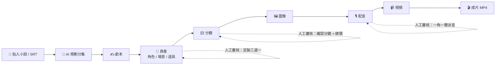
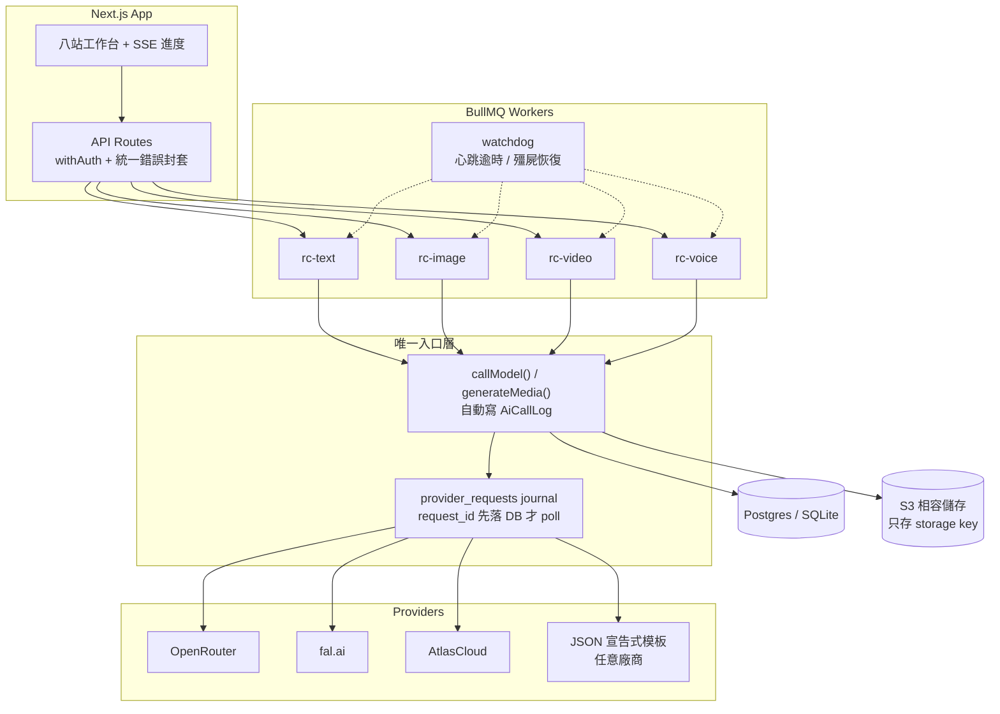

<div align="center">

# 🎬 ReelCraft

**貼上一段小說，產出一集短劇。**

AI 短劇生產平台 — 從小說原文到 9:16 成片，八站引導流程全程可控、全程有價可查。

[](https://github.com/kelvin6365/reelcraft/actions/workflows/ci.yml)
[](LICENSE)
[](https://nextjs.org)
[](https://www.typescriptlang.org)
[](https://www.prisma.io)
[](https://bullmq.io)
[](#-驗證與測試)
[](docs/tech/08-guards.md)

**零 Docker、零設定、零費用即可試玩** — `npm install && npm run dev` 一條命令啟動。

</div>

---

## 目錄

[流程一覽](#流程一覽) · [特點](#-特點) · [快速開始](#-快速開始) · [設定](#-設定) · [架構](#-架構) · [專案結構](#-專案結構) · [驗證與測試](#-驗證與測試) · [部署](#-部署) · [疑難排解](#-疑難排解) · [文檔](#-文檔) · [路線圖](#-路線圖) · [貢獻](#-貢獻) · [致謝](#-致謝) · [授權](#-授權)

## 流程一覽



免費文字站自動接力執行；花費站必定停下，列出「圖 + 視頻 + 配音 ≈ 總價」，授權後才繼續。錢花在哪裡，永遠先看見、後決定。

> **為什麼配音排在視頻之前？** 每個鏡頭要多長，取決於該鏡配音的**真實音檔長度**，不是對白字數的估算。先生片再配音，等於拿一段長度靠猜的影片硬塞一條長度不同的音軌——短了要凍幀補時，長了要硬截斷，兩者都是「聲畫對不上」。配音完成後真實音長會回寫 `Shot.durationMs`，生出來的片長度本來就對。

## ✨ 特點

### 創作體驗

- **三步建專引導流** — 貼入故事（一鍵載入範例小說 / 上載 SRT 自動識別）→ 視覺化選擇畫風與比例 → 選擇產出方式，無需任何預備知識
- **八站引導流程** — 進度總覽條 + 常駐「下一步」卡片 + 失敗抽屜一鍵重試（同目標去重、附失敗時間），隨時清楚下一步
- **自動行進 + 花費檢查點** — 免費文字站自動接力；花費站必停提示，一次知情授權即可自動執行至成片
- **AI 劇集規劃** — 貼入整本小說自動分集（錨定集長或集數），🔴🟡🟢 風險圖示 review-by-exception，無需逐集深審
- **角色一致性** — 多視角 turnaround 定妝 + img2img 參考圖鎖定身份，跨鏡頭保持同一張臉
- **一角一聲配音** — 27 款內置音色庫（性別／年齡／性格標籤）或上載參考音做聲音克隆；AI 派音一鍵配對，戲份前三名不得撞音色。**未派音色不會開始生成**——沒有明確音色來源，provider 會用它自己的預設聲，整集所有角色連旁白同一把
- **成片時間軸編輯器** — 合成前預覽整條時間軸，配音 chip 可拖拉釘位跨鏡頭，CapCut 式獨立音軌語義（配音不會在鏡尾被斬）
- **批量工作台** — 圖像／視頻／配音三站共用同一套選取重做：全選、只選未生成、篩選、預估花費、確認後排隊
- **雙輸入模式** — 小說原文（LLM 全流程）或 SRT 字幕（確定性 1 cue = 1 鏡）
- **進階模式** — 每個生產站可檢視／編輯實際送出的 AI prompt（用戶層／專案層覆寫，canary 鎖定結構）

### 工程與運維

- **零依賴 local 模式** — 沒有 Docker？自動改用 SQLite + 本機檔案 + 內嵌 worker，單一 process 跑完整流程
- **Provider 中立** — `provider::modelId` 嚴格契約；內建 OpenRouter / fal / AtlasCloud 共 21 個模型，亦可用一份 JSON 宣告式模板接入任意廠商
- **模型三層預設** — 系統預設 → 個人預設 → 逐專案覆寫；四種模態任選，缺 key 或能力不匹配自動禁用
- **生成斷點續傳** — provider 的 `request_id` 先寫入 DB 才開始輪詢；worker 被 kill 後重入會續 poll 同一個請求，而不是重新提交（不會為同一次生成付兩次錢）
- **審計一切** — `callModel()` / `generateMedia()` 唯一入口自動記帳（model / tokens / 成本逐筆）；`/usage` 儀表板檢視成本、token、latency
- **生產級任務系統** — BullMQ ×4 佇列 + 心跳 + watchdog 殭屍恢復（worker 被 `kill -9` 後任務自動續跑）
- **商業化 ready** — 真多租戶、BYO-Key 信封加密、預留→結算→退款計費帳本、預算護欄防超支
- **架構守則自動執行** — 17 個 guard 腳本靜態掃描 `src/`，鎖定架構不變式（詳見 [08-guards](docs/tech/08-guards.md)）

## 🚀 快速開始

### 環境需求

| 需求 | 版本 | 備註 |
|---|---|---|
| Node.js | ≥ 20.9（開發於 22 LTS） | Next 16 的下限；worker script 使用 `--env-file` |
| ffmpeg / ffprobe | 任何近期版本 | 影片合成必需；`FFMPEG_PATH` 留空會自動偵測 Homebrew / `/usr/bin` / `PATH` |
| Docker | 選用 | 只有 **full** 模式需要（Postgres + Redis + MinIO）；local 模式完全不需要 |

### 安裝

```bash
git clone https://github.com/kelvin6365/reelcraft && cd reelcraft
npm install
npm run dev   # 就這麼多 — 自動偵測環境、建立 .env、完成資料庫設定
```

`npm run dev` 會先執行 bootstrap，再按偵測結果啟動：

| 偵測結果 | 模式 | 拓撲 |
|---|---|---|
| 找不到 Postgres | **local** | SQLite（`data/local.db`）+ 本機檔案 storage + worker 內嵌，單一 process、零 Docker |
| 偵測到 Postgres | **full** | 單一 terminal 同時啟動 web + worker（BullMQ + Redis） |

- 沒有 API key？bootstrap 自動設定 `MODEL_DEFAULTS_PRESET=fake` — fake providers 走完整流程產出佔位成片，**不產生任何費用**。
- 模式一經偵測即寫入 `.env`（`DEPLOY_MODE`），不會自行切換；強制完整版：`DEPLOY_MODE=full` + `docker compose up -d`。重置 local 模式：`rm -rf data && npm run dev`。
- 需分開執行（除錯）：`npm run dev:web` 與 `npm run worker`。
- 跑真模型的長任務用 `npm run dev:stable`（worker 不跑 tsx watch，避免中途 reload）。

開啟 <http://localhost:3000> → 註冊 → 「開始製作」→ 貼入小說（或一鍵載入範例）→ 系統自動執行至檢查點。

## ⚙️ 設定

所有環境變數以 zod 嚴格驗證（`src/lib/env.ts`），缺漏或型別不符會在啟動時失敗而非執行時才爆。完整清單見 [.env.example](.env.example)，以下是最常改動的幾項：

| 變數 | 預設 | 說明 |
|---|---|---|
| `DEPLOY_MODE` | 由 bootstrap 寫入 | `local`（SQLite + 內嵌 worker）或 `full`（Postgres + Redis + BullMQ） |
| `MODEL_DEFAULTS_PRESET` | 空 | 設為 `fake` 強制所有模態走 fake provider，零費用跑完整流程。**沒有 provider key 的環境必須設定**，否則生成即 `PROVIDER_KEY_MISSING` |
| `OPENROUTER_API_KEY` | — | 文字模型（劇本、分鏡、台詞分析、派音） |
| `FAL_KEY` | — | 圖像與 TTS |
| `ATLASCLOUD_API_KEY` | — | 視頻（系統預設的 i2v 模型在 AtlasCloud） |
| `BILLING_MODE` | `SHADOW` | `SHADOW` 只記帳不攔截；`ENFORCE` 留待 M2 |
| `API_ENCRYPTION_KEY` | dev 佔位值 | BYO-Key 信封加密金鑰，**生產環境必須更換** |
| `QUEUE_CONCURRENCY_*` | 8/10/4/8 | text / image / video / voice 四條佇列的併發 |
| `FFMPEG_PATH` · `FFPROBE_PATH` | 空 | 留空則自動偵測 |

### 系統預設模型

三層解析：系統預設 → 個人預設（`/settings`）→ 逐專案覆寫。系統層是「真實模型地板」，每個值都由 `provider-registry-check` guard 驗證存在於能力目錄：

| 模態 | 系統預設 | 為什麼 |
|---|---|---|
| text | `openrouter::google/gemini-2.5-flash-lite` | 管線文字量大，選最便宜且 JSON 穩定的 |
| image | `fal::fal-ai/nano-banana` | $0.039 統一價，**包含**鏡頭管線倚賴的 `/edit`（參考圖）呼叫 |
| video | `atlascloud::bytedance/seedance-2.0-mini/image-to-video` | 最便宜的 Seedance i2v，$0.056/s |
| tts | `fal::fal-ai/minimax/speech-02-hd` | 內置音色庫，支援 `voice_setting.voice_id` 派音 |

> 模型引用一律使用 `provider::modelId` 複合 key —— 禁止 provider 猜測、靜態映射、預設降級。能力目錄（`standards/capabilities.json`）宣告每個模型的時長格網、比例、參考圖支援、音色模式與定價，錯配一律硬失敗而非靜默降級。

## 🏗 架構



八條架構不變式（違反 = 錯）寫於 [CLAUDE.md](CLAUDE.md)，每一條都配一個 guard 腳本。摘要：

1. 所有表帶 `userId` — 多租戶第一日 ready
2. 所有 AI 呼叫必須經 `callModel()` / `generateMedia()` 唯一入口（自動 audit）
3. Model 引用一律 `provider::modelId` 複合 key
4. DB 只存 storage key，不存媒體 URL — 讀取時簽名 URL 水合
5. API 永不回傳明文金鑰
6. 重試由 app 層決定 — retryable 入 BullMQ 退避，terminal 即 fail
7. Prompt 是資產 — 放 `prompts/`，變數嚴格驗證，canary 迴歸鎖結構
8. 每個架構決策配一個 guard 腳本

## 📁 專案結構

```
src/
  app/            Next.js App Router（頁面 + API routes）
  lib/
    ai/           唯一入口 callModel/generateMedia + adapters + 斷點續傳 journal
    workers/      BullMQ worker、各站 handler、watchdog
    prompts/      prompt 解析、輸出 schema、資產組裝
    voice/        音色庫、綁定解析、派音、真音長回寫
    timeline/     配音擺位（worker 合成與瀏覽器預覽共用同一模組）
    video/        ffmpeg 合成
    billing/      計費帳本、預算護欄、成本預估
  ui/             工作台元件（八站 panel、時間軸編輯器、批量工作台）
prompts/          prompt 資產：catalog.json + pipeline/ + styles/ + canary/
standards/        能力目錄、音色庫、定價、宣告式模板
scripts/guards/   17 個架構 guard
docs/             產品設計（plans/）+ 技術 spec（tech/）
tests/            771 個測試
```

## ✅ 驗證與測試

```bash
npm run check                # 17 guards + typecheck
npm test                     # 771 tests（vitest）
npm run smoke:pipeline       # 小說→mp4 離線 E2E（full 模式）
npm run smoke:pipeline:local # 同上，local 模式（SQLite + 內嵌 worker）
npm run smoke:batch          # 兩集批量自動出片 E2E
npm run smoke:srt            # SRT 輸入路線 E2E
npm run smoke:plan           # 長篇分集規劃 E2E
npm run smoke:task           # kill -9 worker 恢復測試
npm run smoke:ai             # 真 provider 連通性檢查（需要 key）
```

全部 smoke script 皆預設 `MODEL_DEFAULTS_PRESET=fake`，不會產生費用。

[CI](.github/workflows/ci.yml) 在每個 PR 執行兩個 job：`check`（17 guards + typecheck + 771 tests，無需任何外部服務）與 `e2e`（離線全管線 小說→mp4，local 模式 + fake providers）。

> `smoke:pipeline:local` 會把 repo 的 Prisma client 重新生成到 SQLite schema。在 Postgres 開發環境跑完後，執行 `npx prisma generate` 還原。

## 📦 部署

見 [docs/deploy.md](docs/deploy.md) — 單 VPS docker-compose，app/worker 分離，可 `--scale worker=3`。

生產環境必改：`API_ENCRYPTION_KEY`、`BETTER_AUTH_SECRET`、`STORAGE_*`、`DATABASE_URL`。

## 🔧 疑難排解

| 症狀 | 原因與處理 |
|---|---|
| 生成即 `PROVIDER_KEY_MISSING` | 系統預設是真實模型。沒有 key 的環境要設 `MODEL_DEFAULTS_PRESET=fake` |
| 任務永遠卡在 `queued` | worker 沒有在跑。`npm run dev` 已同時啟動兩者；手動分開時要 `npm run dev:web` + `npm run worker` |
| 改完 schema 後 route 500 | Next dev 持有舊的 `@prisma/client`。跑完 migration **必須重啟 dev server**，`npx prisma generate` 並不足夠 |
| 配音站不動、顯示「餘 N 把聲未揀音色」 | 這是設計行為，不是故障。沒有明確音色來源，TTS 會跌回 provider 預設聲（整集同一把），因此未派晒音色不會開任務。撳「AI 派音」或逐個挑選即可 |
| 視頻站被標為 blocked | 配音未完成。鏡頭長度取自真實音長，配音未齊就生片，長度一定錯，重生即是多付一次錢 |
| 合成失敗、找不到 ffmpeg | 安裝 ffmpeg，或明確設定 `FFMPEG_PATH` / `FFPROBE_PATH` |

## 📚 文檔

| 文檔 | 內容 |
|---|---|
| [產品設計](docs/plans/2026-07-18-reelcraft-mvp-design.md) | 產品決策唯一真相來源 |
| [技術 spec](docs/tech/README.md) | 資料模型、任務系統、provider 層、審計、prompts、guards |
| [架構鐵律](CLAUDE.md) | 八條不變式，違反 = 錯 |
| [部署](docs/deploy.md) | docker-compose 單 VPS 部署 |
| [貢獻指南](CONTRIBUTING.md) | 開發環境、提交前檢查、PR 慣例 |
| [安全政策](SECURITY.md) | 漏洞回報流程、敏感攻擊面、部署者必改的設定 |

`docs/plans/` 另有 15 份設計文檔，記錄每個子系統的決策脈絡與被否決的方案。

## 🗺 路線圖

- [x] 八站管線：小說 → 劇本 → 資產 → 分鏡 → 圖像 → 配音 → 視頻 → 成片
- [x] 批量出片、自動行進 + 花費檢查點
- [x] 生成斷點續傳、watchdog 殭屍恢復
- [x] 一角一聲配音（音色庫 + AI 派音）、真音長驅動鏡頭長度
- [x] 成片時間軸編輯器
- [ ] 嘴型對齊（lip-sync）— 目前長度已對齊，但 i2v 生成時並不知道台詞，口型仍非精確對嘴
- [ ] 配音 lead-in — 目前每鏡第一句由 0ms 起唱
- [ ] `BILLING_MODE=ENFORCE` 真實扣費
- [ ] 多語 UI

## 🤝 貢獻

歡迎 issue 與 PR。完整指引見 [CONTRIBUTING.md](CONTRIBUTING.md)；動手前請先讀 [CLAUDE.md](CLAUDE.md)（八條架構不變式）與 [docs/tech/](docs/tech/README.md)。

```bash
npm run check   # 提交前必跑：17 guards + typecheck
npm test
```

三條最常被忘記的慣例：

- **每個 PR 一條薄片** — 交付必須貫通「貼文 → 出成品」的某一段，不做半截的鋪墊
- **新增架構決策的 PR 必須附一個 guard 腳本**（`scripts/guards/`），這是 review checklist 第一條
- **Prompt 不准 inline 寫在 code 中** — 放 `prompts/`，同步加 catalog 條目與 canary 樣本

安全問題請勿開公開 issue，見 [SECURITY.md](SECURITY.md)。

## 🙏 致謝

ReelCraft 的產品與架構研究深度受益於以下三個開源短劇專案 —— 我們研讀了它們的架構取捨與社群回饋，並以此定義了 ReelCraft 的方向：

| 專案 | 授權 | 啟發 |
|---|---|---|
| [huobao-drama](https://github.com/chatfire-AI/huobao-drama)（火豹短劇） | CC BY-NC-SA | 參考圖壓縮正規化、幀鏈思想、角色音色庫分配模式；其社群回饋直接形塑了本專案的計費透明與失敗處理設計 |
| [Toonflow](https://github.com/HBAI-Ltd/Toonflow-app) | Apache（附商業限制） | `@图N` 參考綁定、多視角 turnaround 定妝、空間一致性規則 |
| [waoowaoo](https://github.com/waooAI/waoowaoo) | CC BY-NC-SA | fal provider 落地模式、音色雙來源（內置庫／參考音克隆）與派音閘設計；其社群回饋催生了本專案的任務恢復與去重設計 |

> **授權聲明**：基於上述專案的授權條款，ReelCraft **未複製任何程式碼或 prompt 原文** —— 僅借鑑公開的架構模式與設計思想，全部實作從零完成。詳見 [CLAUDE.md](CLAUDE.md) 授權警示一節。

## 📄 授權

[AGPL-3.0](LICENSE)。以本軟體提供網絡服務須開源您的修改；商業授權（豁免 AGPL 義務）另洽。
