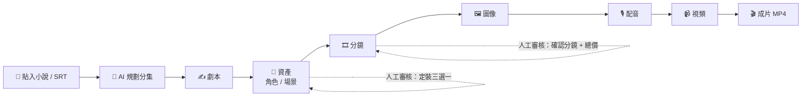

<div align="center">

# 🎬 ReelCraft

**貼上一段小說，產出一集短劇。**

AI 短劇生產平台 — 從小說原文到 9:16 成片，八站引導流程全程可控、全程有價可查。

[](LICENSE)
[](https://nextjs.org)
[](https://www.typescriptlang.org)
[](https://www.prisma.io)
[](https://bullmq.io)

**零 Docker、零設定、零費用即可試玩** — `npm install && npm run dev` 一條命令啟動。

</div>

---

## 流程一覽



免費文字站自動接力執行；花費站必定停下，列出「圖 + 視頻 + 配音 ≈ 總價」，授權後才繼續。錢花在哪裡，永遠先看見、後決定。

## ✨ 特點

### 創作體驗

- **三步建專引導流** — 貼入故事（一鍵載入範例小說 / 上載 SRT 自動識別）→ 視覺化選擇畫風與比例 → 選擇產出方式，無需任何預備知識
- **八站引導流程** — 進度總覽條 + 常駐「下一步」卡片 + 失敗抽屜一鍵重試（同目標去重、附失敗時間），隨時清楚下一步
- **自動行進 + 花費檢查點** — 免費文字站自動接力；花費站必停提示，一次知情授權即可自動執行至成片
- **AI 劇集規劃** — 貼入整本小說自動分集（錨定集長或集數），🔴🟡🟢 風險圖示 review-by-exception，無需逐集深審
- **角色一致性** — 多視角 turnaround 定妝 + img2img 參考圖鎖定身份，跨鏡頭保持同一張臉
- **批量出片** — 一鍵全季自動生成：分鏡可自動確認、跳過視頻的省錢模式、全季進度板逐集亮燈
- **雙輸入模式** — 小說原文（LLM 全流程）或 SRT 字幕（確定性 1 cue = 1 鏡）
- **進階模式** — 每個生產站可檢視／編輯實際送出的 AI prompt（用戶層／專案層覆寫，canary 鎖定結構）

### 工程與運維

- **零依賴 local 模式** — 沒有 Docker？自動改用 SQLite + 本機檔案 + 內嵌 worker，單一 process 跑完整流程
- **Provider 中立** — `provider::modelId` 嚴格契約；內建 OpenRouter / fal / AtlasCloud，亦可用一份 JSON 宣告式模板接入任意廠商
- **模型三層預設** — 系統預設 → 個人預設 → 逐專案覆寫；四種模態任選，缺 key 或能力不匹配自動禁用
- **審計一切** — `callModel()` 唯一入口自動記帳（model / tokens / 成本逐筆）；`/usage` 儀表板檢視成本、token、latency
- **生產級任務系統** — BullMQ ×4 + 心跳 + watchdog 殭屍恢復（worker 被 kill -9 後任務自動續跑）
- **商業化 ready** — 真多租戶、BYO-Key 信封加密、預留→結算→退款計費帳本、預算護欄防超支
- **架構守則自動執行** — 13 個 guard 腳本在 CI 鎖定架構不變式

## 🚀 快速開始

```bash
git clone https://github.com/kelvin6365/reelcraft && cd reelcraft
npm install
npm run dev   # 就這麼多 — 自動偵測環境、建立 .env、完成資料庫設定
```

`npm run dev` 會先執行 bootstrap，再按偵測結果啟動：

| 偵測結果 | 模式 | 拓撲 |
|---|---|---|
| 找不到 Postgres | **local** | SQLite（`data/local.db`）+ 本機檔案 storage + worker 內嵌，單一 process、零 Docker |
| 偵測到 Postgres | **full** | 單一 terminal 同時啟動 web + worker（BullMQ + Redis） |

- 沒有 API key？bootstrap 自動設定 `MODEL_DEFAULTS_PRESET=fake` — fake providers 走完整流程產出佔位成片，**不產生任何費用**。
- 填入 `OPENROUTER_API_KEY` / `FAL_KEY` 即為真實生成（系統預設 kling-v3 / nano-banana-pro / minimax TTS，可於 `/settings` 修改）。
- 模式一經偵測即寫入 `.env`（`DEPLOY_MODE`），不會自行切換；強制完整版：`DEPLOY_MODE=full` + `docker compose up -d`。重置 local 模式：`rm -rf data && npm run dev`。
- 需分開執行（除錯）：`npm run dev:web` 與 `npm run worker`。

開啟 http://localhost:3000 → 註冊 → 「開始製作」→ 貼入小說（或一鍵載入範例）→ 系統自動執行至檢查點。

## ✅ 驗證

```bash
npm run check                # 13 guards + typecheck
npm test                     # 430+ tests
npm run smoke:pipeline       # 小說→mp4 離線 E2E（full 模式）
npm run smoke:pipeline:local # 同上，local 模式（SQLite + 內嵌 worker）
npm run smoke:batch          # 兩集批量自動出片 E2E
npm run smoke:task           # kill -9 worker 恢復測試
```

## 📦 部署

見 [docs/deploy.md](docs/deploy.md) — 單 VPS docker-compose，app/worker 分離，可 `--scale worker=3`。

## 📚 文檔

| 文檔 | 內容 |
|---|---|
| [產品設計](docs/plans/2026-07-18-reelcraft-mvp-design.md) | 產品決策唯一真相來源 |
| [技術 spec](docs/tech/README.md) | 資料模型、任務系統、provider 層、審計、prompts、guards |
| [架構鐵律](CLAUDE.md) | 八條不變式，違反 = 錯 |

## 🛠 技術棧

Next.js 16 · TypeScript · PostgreSQL / SQLite + Prisma · BullMQ + Redis · MinIO / R2 · Better-Auth · Tailwind v4 + shadcn/ui · TanStack Query · ffmpeg

## 🙏 致謝

ReelCraft 的產品與架構研究深度受益於以下三個開源短劇專案 —— 我們研讀了它們的架構取捨與社群回饋，並以此定義了 ReelCraft 的方向：

| 專案 | 授權 | 啟發 |
|---|---|---|
| [huobao-drama](https://github.com/chatfire-AI/huobao-drama)（火豹短劇） | CC BY-NC-SA | 參考圖壓縮正規化、幀鏈思想；其社群回饋直接形塑了本專案的計費透明與失敗處理設計 |
| [Toonflow](https://github.com/HBAI-Ltd/Toonflow-app) | Apache（附商業限制） | `@图N` 參考綁定、多視角 turnaround 定妝、空間一致性規則 |
| [waoowaoo](https://github.com/waooAI/waoowaoo) | CC BY-NC-SA | fal provider 落地模式；其社群回饋催生了本專案的任務恢復與去重設計 |

> **授權聲明**：基於上述專案的授權條款，ReelCraft **未複製任何程式碼或 prompt 原文** —— 僅借鑑公開的架構模式與設計思想，全部實作從零完成。詳見 [CLAUDE.md](CLAUDE.md) 授權警示一節。

## 📄 授權

[AGPL-3.0](LICENSE)。以本軟體提供網絡服務須開源您的修改；商業授權（豁免 AGPL 義務）另洽。
